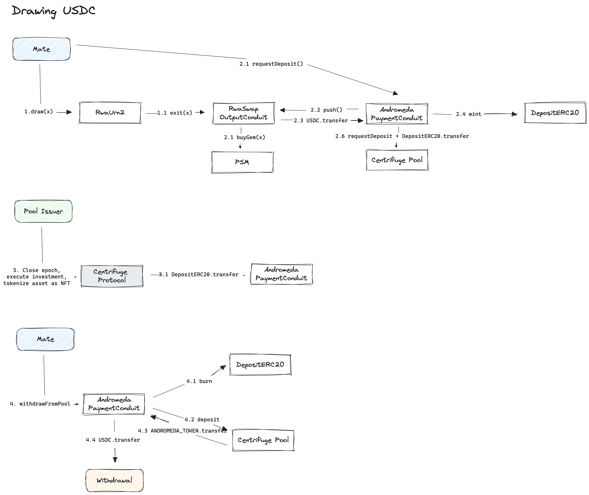

# Andromeda Payment Conduit

This adapter acts as the `mate` and `operator` of the output conduit of the [MIP21 RWA toolkit contracts](https://github.com/makerdao/rwa-toolkit/tree/master). It controls the `gem` and sends this to a fixed `withdrawal` address, that is controlled by the `ward`s.

It ties the bookkeeping of withdrawals and repayments to a Centrifuge pool. For this, it mints a custom `Deposit ERC20`, that represents the amount of `gem` locked in the adapter. This ensures that `gem` (e.g. USDC) never leaves the adapter, except to either
* The `withdrawal` address
* One of the `InputConduit`s for repayments

The Centrifuge pool contract is based on the [ERC-7540](https://eips.ethereum.org/EIPS/eip-7540) standard.

## Withdrawal flow
To draw down new funds, DAI is swapped to `gem`, pushed to the adapter, and `Deposit ERC20` tokens are minted and transferred to the Centrifuge pool. Once the tokenization of the new assets is finished, the tranche tokens from the Centrifuge pool are transferred to the adapter, the `Deposit ERC20` is burned and `gem` is transferred to the withdrawal address.

## Repayment flow
To repay, a redemption is initiated to the Centrifuge pool. This transfers the tranche tokens back to the Centrifuge pool (and burns them once the redemption request is fulfilled). Afterwards, the `mate` can transfer `gem` to either the jar or urn input conduit, to repay stability fees or principal respectively.

## Emergency flows
The adapter has been designed that if the Centrifuge pool stops operating correctly for any reason, the `mate` of the adapter can always continue to repay to Maker, or withdraw funds. There are two emergency methods for this, `unlock()` to enable repayments, and `authMint` to mint `Deposit ERC20` tokens for withdrawals.

## License
This codebase is licensed under [GNU Lesser General Public License v3.0](https://github.com/centrifuge/andromeda-payment-conduit/blob/main/LICENSE).
